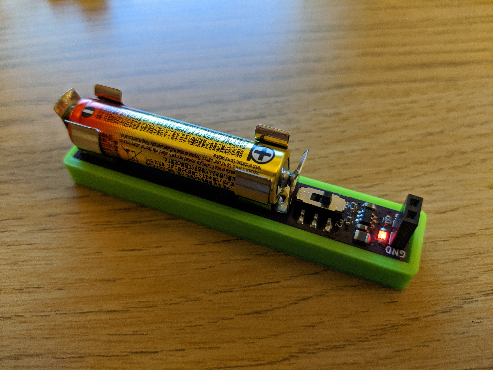
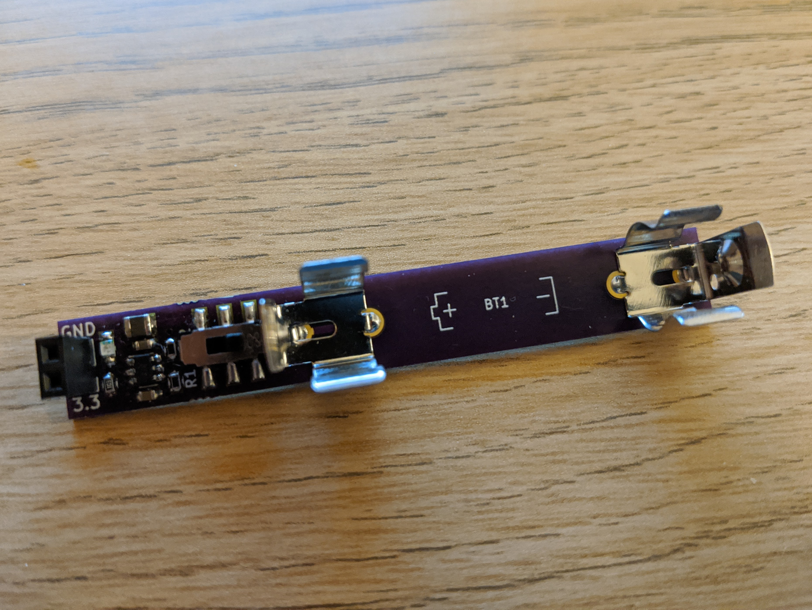
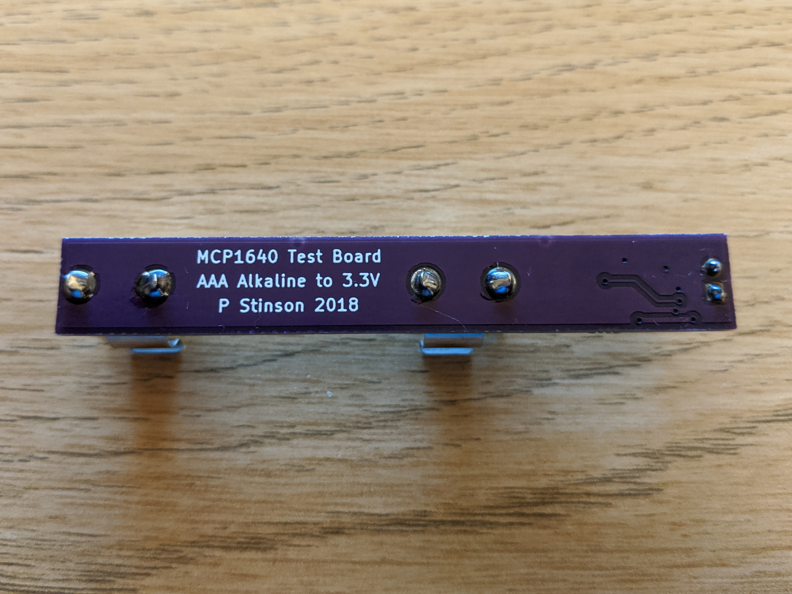

# mini-power-supply
A small 3.3V power supply, powered by a single AAA battery and utilising the MCP1640 boost regulator.

The design includes a power switch to turn the supply on and off, as well as a power indicator LED. The MCP1640, from Microchip Technology, is rated to output ~100mA at the input voltage range produced by the single AAA cell. A simple 3d printed base for the supply is also included in this repository.

